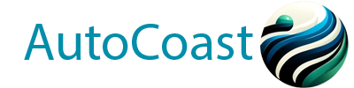
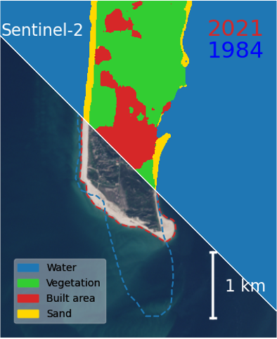
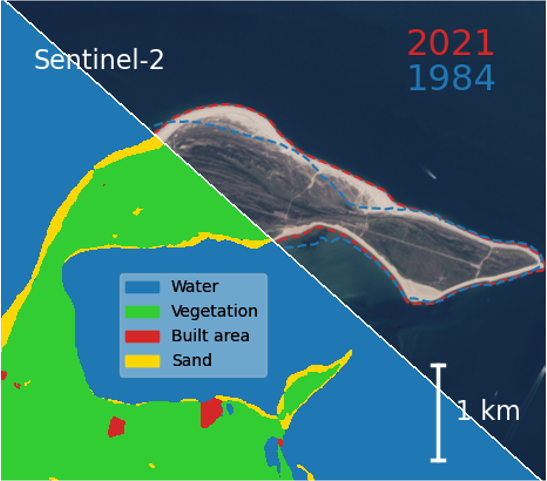

# Coastal Change Detection Using Remote Sensing and Deep Learning

## Abstract
This project leverages remote sensing data, particularly from Sentinel-2 and Landsat satellites, combined with deep learning techniques to identify and monitor coastlines. Our current focus is on the North and Baltic Seas, with goals to detect changes over the past 40 years and predict changes for the next 100 years. Key areas of our current work include active learning, pre-labelling, and developing a labelling tool for remote sensing data.

## Visual Motivation for Our Project
<!-- 
 -->
<!-- 
 -->

</div

Here we see the German island of Sylt. On the left, we observe the southern part of the island. The dashed blue line represents the coastline as it was in 1984. Over the past 4 decades, approximately 1 km of this coastline has disappeared. Conversely, in the northern part of the island, the coastline has even expanded in certain areas during the same period. In the case of Sylt the changes are driven by a combination of human and natural drivers. Strong long-shore currents are eroding the southern part of the island and the sandy beaches on the west of Sylt. In order to keep the tourists the beaches are nourished regularly. The deposited sand in the west is then finding its way up to the north of the island. Our goal is to identify these changes on a larger scale (both coastline change and coastline type change), understand both human and natural causes, and predict future developments.

## Repository Links
- [Active Learning Repository](https://github.com/autocoast/active-learning-sentinel-s2.git)
- [Pre-labelling Repository](https://github.com/yourusername/pre-labelling-repo)
- [Labelling Tool Repository](https://github.com/autocoast/remote-sensing-labelling-tool)

## Contact
For questions or suggestions, please open an issue or contact us at david.pogorzelski@hereon.de or peter.arlinghaus@hereon.de
